# PLA_NCK

A low profile split keyboard I built using Gateron KS-33 low profile switches.

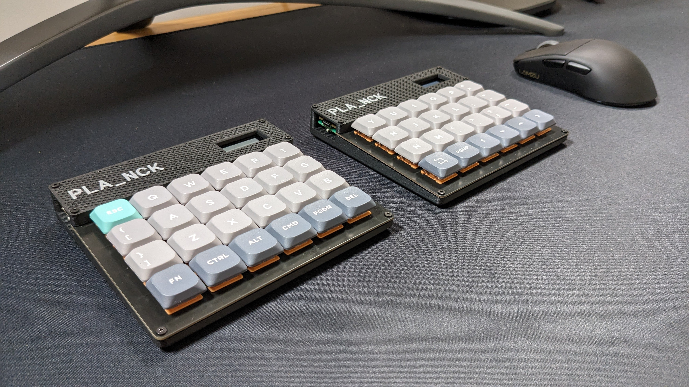

## Story

I had assembled a Ferris Sweep previously but I hated the Kailh Low Profile Choc Switches but but wanted something low profile.
Sincve I couldn't find anything at the time I decided to learn KiCad and Fusion360 to create my own design.

I've called it the PLA_NCK because my original intention was to create a split [ZSA Planck EZ](https://blog.zsa.io/2307-goodbye-planck-ez/) (discontinued) since it has probably been my favourite layout to date. I justed wanted a split, bluetooth and low profile version with Gateron KS-33 switches after using the [NuPhy Air60](https://nuphy.com/collections/keyboards/products/air60) with [Daisy](https://nuphy.com/collections/switches/products/nuphy-daisy-l48-switches) Gateron colaboration switches.
I couldn't quite fit the controller under the keys while keeping it low so I gave up and added the nice view as well for this version so my homage to the original Planck is a bit shit. 
I might attempt it again with without a pre-made controller when my KiCad skills improve so I can ditch the display and make it closer to the split plank low profile vision I started with.

## BOM

The AliExpress stuff will be hit and miss.

* NuPhy [Daisy](https://nuphy.com/collections/switches/products/nuphy-daisy-l48-switches) switches.
* NuPhy [COAST Twilight nSA Dye-sub PBT Keycaps](https://nuphy.com/collections/keycaps/products/twilight-nsa-dye-sub-pbt-keycaps)
* GATERON KS-27 or KS-33 [Low Profile switch Hot-swap PCB 2.0 Socket](https://www.aliexpress.com/item/1005004128409069.html) these were hard to find.
* PCB and Plate [JLCPCB](https://jlcpcb.com) was much cheaper than PCBWay when I got a quote for the exported gerbers. The quaility was fine.
* 4xM2 4mm screws.
* 8xM2 12-14mm screws.
* 12 x [M2 OD3.2mm 3mm](https://www.aliexpress.com/item/1005003582355741.html) brass hot melt insert nuts.
* 3D printer for the case, cover and optional nice view guard.

## Build

Everything you need is included in this repo I think.

1. You need to order both the plate and PCB as the GATERON KS-33 keys are only 3 pin and don't have the plastic alignment tabs so can only be used hot-swap with this design.
2. The nice view guard is in case you are worried about shorting your nice view on the battery case material.
3. I 3D printed the cover without a top and bottom layer using 60% infilled 3D honeycomb pattern. I paused the print at layer 78 to change my matte black PLA out for matte grey. I've included the bambu studio files if you happen to own a Bambu Labs printer or can use the configuration.

## Gallery

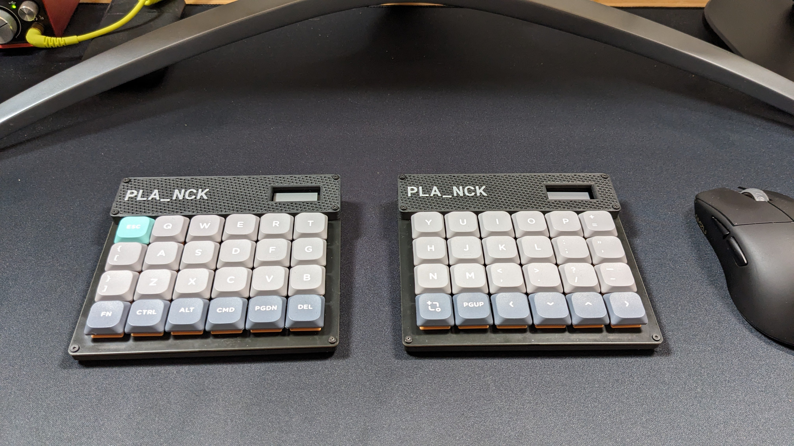
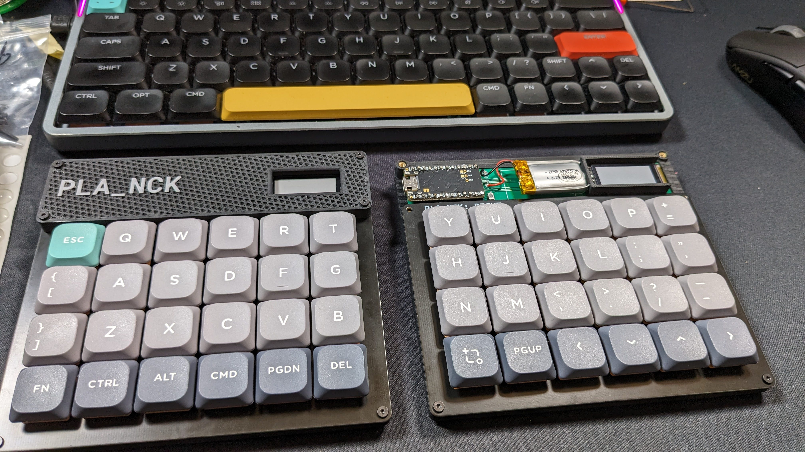
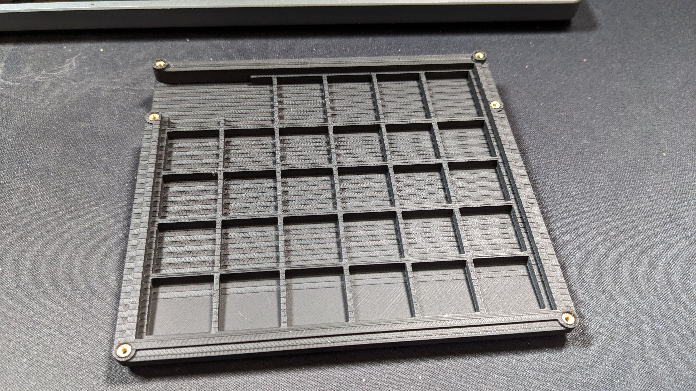
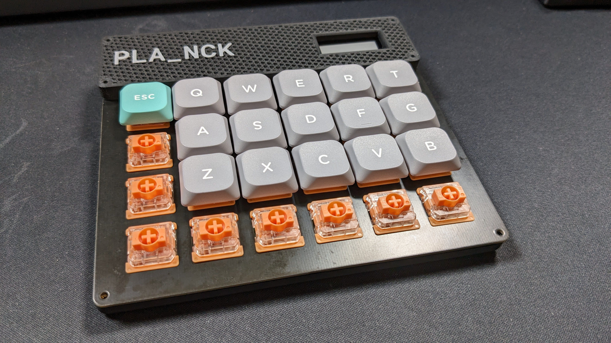
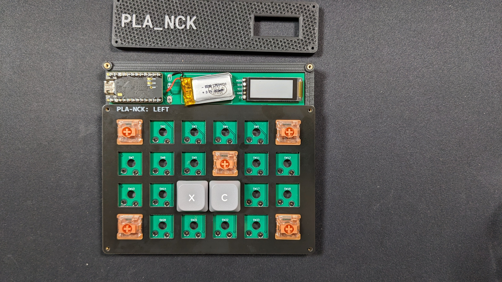
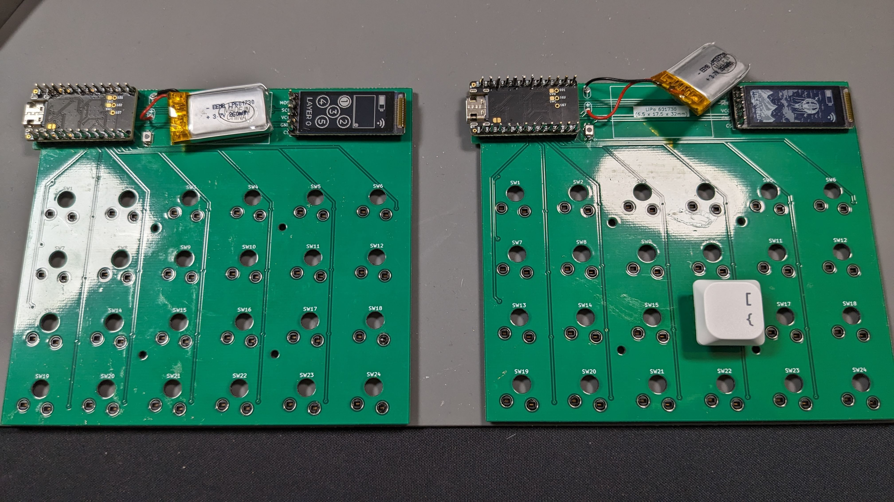
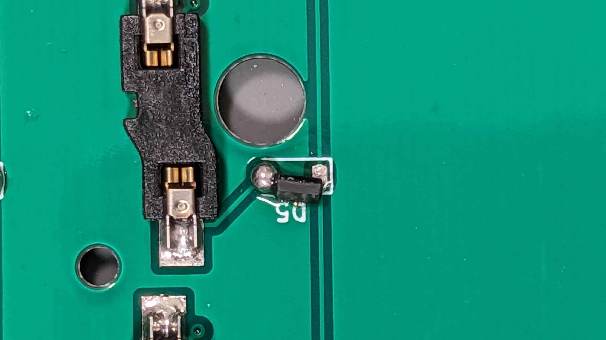
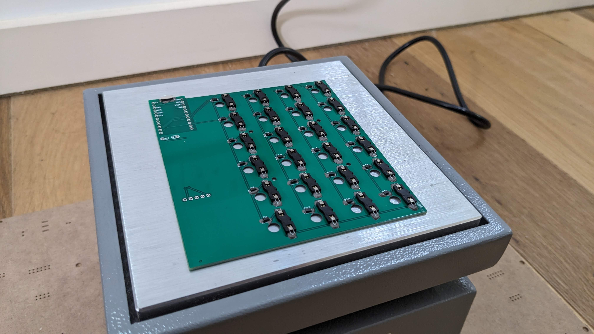
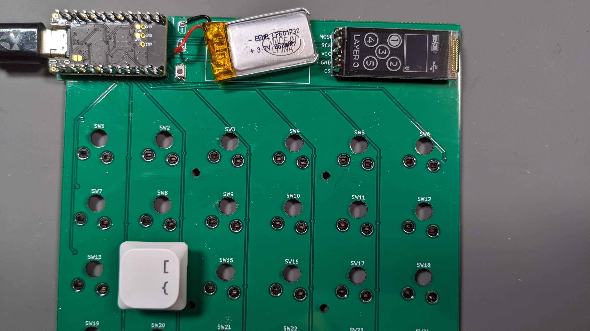
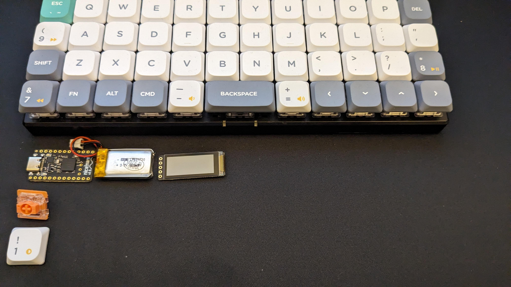
